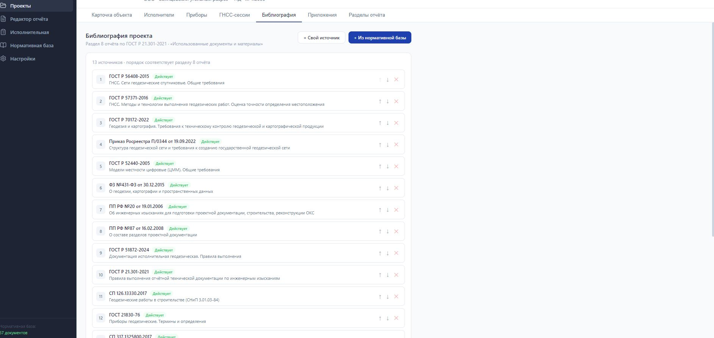

# ИГДИ Report Generator — AI-ассистент цифровизации горных работ

Десктопное ПО для автоматизированного формирования технических отчётов 
по результатам инженерно-геодезических изысканий (ИГДИ).

**Статус:** Production · 4 активных пользователя · Модуль БПЛА-обработки в ОПЭ

---

## Что делает продукт

- Автогенерация технических отчётов по ГОСТ Р 21.301-2021
- Встройка растровых данных, Excel, Word, PDF в единый документ
- Система сравнения проектных vs. фактических данных в реальном времени
- Модуль обработки БПЛА-данных с AI-ассистентом (стадия ОПЭ)

## Результаты внедрения

| Метрика | До | После |
|---|---|---|
| Цикл подготовки отчёта | 3 недели | 3 дня |
| Ручной труд | — | −60% |
| Time-to-Market MVP | — | −40% |
| Оперативный контроль БПЛА | — | +25% |

## Технологический стек

`Electron` · `React` · `TypeScript` · `SQL.js` · `Python ML` · 
`Claude Code` · `QGIS` · `PostGIS` · `Computer Vision`

## Метод разработки

Продукт создан методом AI-ассистированной разработки (вайбкодинг 
с Claude Code) — постановка задач AI-инструменту без 
самостоятельного написания кода.

**Роль:** Product Owner + архитектор решений  
**Период:** 12 месяцев (2025–2026)  
**Отрасль:** Горнодобывающая промышленность, открытые горные работы  

## Скриншоты

**Карточка объекта** — геодезические параметры, система координат, сроки работ

**Нормативная база** — 67 документов с актуальным статусом (БПЛА, ГНСС, топосъёмка)

**Редактор отчёта** — приложения по ГОСТ Р 21.301-2021, управление составом документации

**Список оборудования** — тахеометры, ГНСС-приёмники, БПЛА с поверочными данными

**Настройка штампа** — основная надпись по ГОСТ Р 21.101-2020

**Библиография** — автоформирование раздела 8 отчёта по нормативной базе

## Автор

**Кружков Илья Александрович**  
Product Owner · Руководитель направления цифровой трансформации и R&D  
📧 kruzhkov88@mail.ru  
✈️ Telegram: @kruzhkov88
